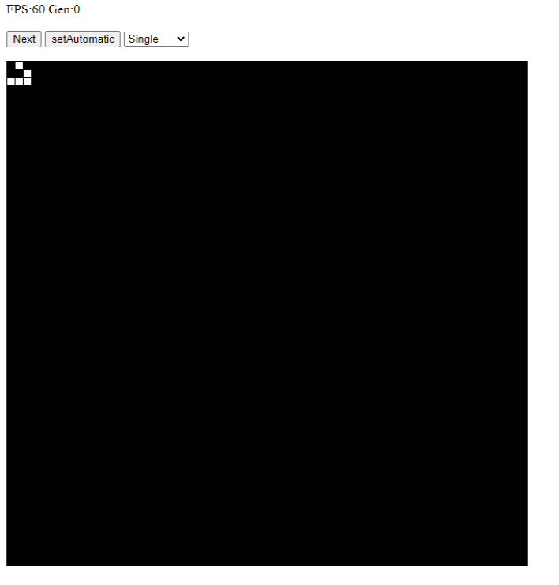

# Conway's Game of Life

[](https://doi.org/10.5281/zenodo.10044376)

## Overview
The project aims to realize a custom implementation of the famous Conway's Game of Life automata as web server by using Python and Flask.
The service can be run directly through the repo os by using the Docker image available in the GitHub registry.

For more details check the [Get started now](#getting-started) section.

## Game of Life
The Game of Life, also known simply as Life, is a cellular automaton devised by the British mathematician John Horton Conway in 1970 and demonstrated to be Turing complete.
The game is a zero-player game, meaning that its evolution is determined by its initial state, requiring no further input.
One interacts with the Game of Life by creating an initial configuration and observing how it evolves.

The universe of the Game of Life is a two-dimensional orthogonal grid of square cells, each of which is in one of two possible states, alive or dead, or "populated" or "unpopulated".
Every cell interacts with its eight neighbours, which are the cells that are horizontally, vertically, or diagonally adjacent.
At each step in time, the following rules, which compare the behaviour of the automaton to real life, occur:
1) Any live cell with fewer than two live neighbours dies, as if by underpopulation.
2) Any live cell with two or three live neighbours lives on to the next generation.
3) Any live cell with more than three live neighbours dies, as if by overpopulation.
4) Any dead cell with exactly three live neighbours becomes a live cell, as if by reproduction.

The initial pattern constitutes the seed of the system.
The first generation is created by applying the above rules simultaneously to every cell in the seed; births and deaths occur simultaneously, and the discrete moment at which this happens is sometimes called a tick.
Each generation is a pure function of the preceding one.

Since its publication, the Game of Life has attracted much interest because of the surprising ways in which the patterns can evolve.
Many different types of patterns occur in the Game of Life, which are classified according to their behaviour. Common pattern types include still lifes, which do not change from one generation to the next, oscillators, which return to their initial state after a finite number of generations and spaceships, which translate themselves across the grid.

Still Lifes            |  Oscillators          |  Spaceship
:-------------------------:|:-------------------------:|:-------------------------:
  |   |  


## Quadtree application
In a common implementation of the Game of Life automata, each cell is explored to update it for the next generation, even if it remains in the same state. However, according to the rules of the automata, it is unnecessary to control cells that do not have any living cells in a certain range around them. This is why indexing techniques are often used to optimize the process. This Conway's Game of Life project relies on the quadtree indexing technique to efficiently update the cells.
Quadtrees are a tree data structure in which each internal node has exactly four children. Quadtrees are most often used to partition a two-dimensional space by recursively subdividing it into four quadrants or regions. The regions may be square or rectangular.

In this application, the grid constitutes the root of the tree and each time a new cell is added, the tree is subdivided into four quadrants. The subdivision is repeated until the maximum number of cells per quadrant is reached.
Then, the tree structure can be easily queried to retrieve all the quadrants which contains active cells. This way, the number of cells to be explored is always minimized favouring a faster execution of the generations. This is particularly usefull when the number of alive cell is high and the grid is sparse.


## Getting Started
There are two possibilities to run the service properly

### Python Web Server
To run the service locally, you need to install the requirements
```bash
git clone https://github.com/xAlessandroC/ConwayGameOfLife
pip install -r requirements.txt
```

Finally run the server
```bash
cd gameoflife
flask --app app --debug run --host <IP> --port <PORT>
```

The application should be available at the following address: http://\<IP>:\<PORT>/

### Docker Image
An already-configured Docker image is available in the GitHub registry. To run the service, you need to pull the image and run it.
```bash
docker pull ghcr.io/xalessandroc/game-of-life:latest
docker run -p <PORT>:5000 ghcr.io/xalessandroc/game-of-life:latest
```

The application should be available at the following address: http://\<IP>:\<PORT>/

## How to Use
The application is composed by a single main page



The main page is composed by a grid and a control panel. The grid is used to visualize the current state of the automata and the control panel is used to interact with the automata. On the top of the page are also displayed information related to the FPS metric and the number of the current generation.
The control panel is composed by the following elements:
- **Next**: This button is used to compute the next generation of the automata
- **SetAutomatic**: This button is used to start the automatic computation of the generations. To stop the automatic computation, the button must be pressed again.
- **Pattern Menu**: This menu allows for the selection of pattern to insert in the grid to check the evolution in time.


## How to Cite
This project has been developed for the course "DevOps Meets Scientific Research" held by Prof. Danilo Pianini at the University of Bologna.

It is possible to cite the work and the repository on Zenodo using the following format:
```
Alessandro Calvio. (2023). xAlessandroC/ConwayGameOfLife: v0.0.2 (v0.0.2). Zenodo. https://doi.org/10.5281/zenodo.10044271
```
